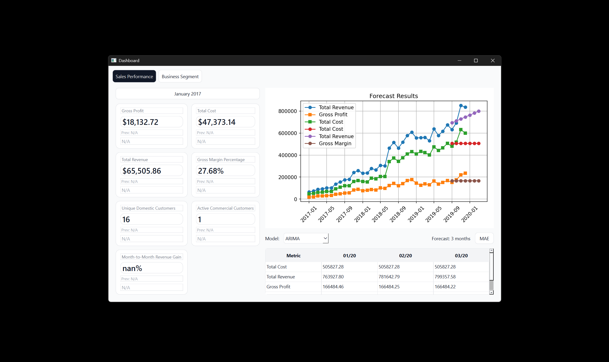
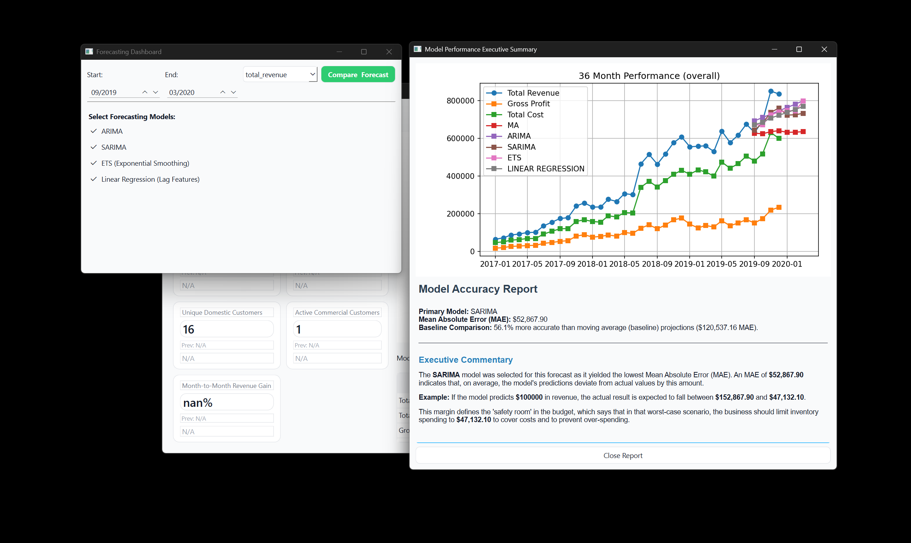

# Business KPI Forecasting Tool

## Credits
Built with (LinkedIn | GitHub):
- Abdul-Qudus Amidu [L](https://www.linkedin.com/in/abdul-qudus-amidu-41637b2b4/) | [G](https://github.com/nanodecimeter)

As part of COMPSYS302 at the University of Auckland (2026).

A Python application that ingests business data and forecasts KPIs across multiple predictive models, enabling side-by-side comparison to identify the best fit.

[DEMO](https://www.youtube.com/watch?v=iLVM6w_No4c)

<table style="width:100%; table-layout:fixed;">
    <tr>
        <td align="center">
         Sales dashboard</td>
        <td align="center">
         Forecasting dashboard and report</td>
    </tr>
</table>

## Overview

For my course, COMPSYS302, I was tasked with my group to create a Python program that could be used as a tool to calculate business KPIs and forecast data using statistical models. Beyond Python, the new learning experience was definitely the statistical models, which I delved into a lot deeper than the code to understand how they work mathematically, to figure out their disadvantages and advantages.

Also learned a new principle, [Occam's Razor](https://en.wikipedia.org/wiki/Occam%27s_razor), which I find really cool!

## How It Works

The program automatically validates files based on header information, extensions, title, and any duplicates of the same file. Upon successful validation, the entire program operates with minimal interaction (by design), as all the forecasting metrics (for the future 3 months) are already displayed, and the user simply just needs to select which month and year of data they want displayed, as well as selecting which forecasting model they want.

Should the user choose to explore deeper, they can access the forecasting UI which allows them to select and compare forecasting models for any time period (assuming there is at least 24 months of data before the starting date of forecast). The UI automatically formats a report that explains which model is the best, how much better it is than the baseline (moving average), and the suggested action for the company to take based on the model findings.

## Contribution

My role in the project was to implement all the forecasting, which includes the comparison of different models, the immediate update of graphs to show the currently selected model, the metrics for the next 3 months, and the forecasting report.